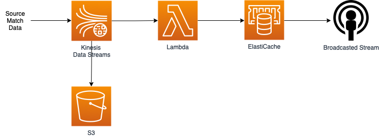

# IMG Arena DataOps Tech Test - Alisha Wong

## Functional Requirements
See [processor.py](data_processor/processor.py) for my solution. 

As recommended by Laurence, I wrote a solution using Pandas. I processed the data as a whole data set 
(using the [keystrokes-for-tech-test.csv](data/keystrokes-for-tech-test.csv)) but please see my comments below 
about how I would process the data if it was streamable.

### R&D
A feature that would be interesting for end user - serve speed

## Non Functional Requirements

### Streamable
If the application is supposed to process the source data an event at a time, I wouldn't use Pandas to process the data. 
I believe Pandas should be used when processing whole data sets at a time, not for just one row at a time 
(though I could be wrong!).
Perhaps Spark is better for stream processing...?
Think you can enforce schemas with Spark too as per the "Data contract" requirement.

### Cloud Architecture

**AWS Kinesis Data Streams**
- To ingest match data that is streamed in an event at a time
- Chose Kinesis (over Kafka) because the integration with Lambda may be more seamless as it's also an AWS service?

**S3**
- To store all the raw data (data lake)

**Lambda**
- Invoked by upstream Kinesis when data event comes in
- Low latency, high availability (therefore reliable - don't want this process to break during a match)
- Scalable, so can handle multiple matches going on at a same time
- Python application is simple enough to be written as a Lambda (vs Docker container running on ECS)

**ElastiCache**
- Fast retrieval of data (as in-memory?)
- Low latency

Infrastructure provisioned with Terraform and Terraform workspaces

### Development Flow
- CICD pipeline 
  - Feature branches trigger dev/preprod pipelines
  - Merges to main trigger prod pipelines
  - Pipelines zip up data processor for Lambda
  - Terraform plan and apply
- Precommit hooks 
  - black for python formatting
  - terraform_fmt for terraform formatting
  - tfsec for terraform security checks